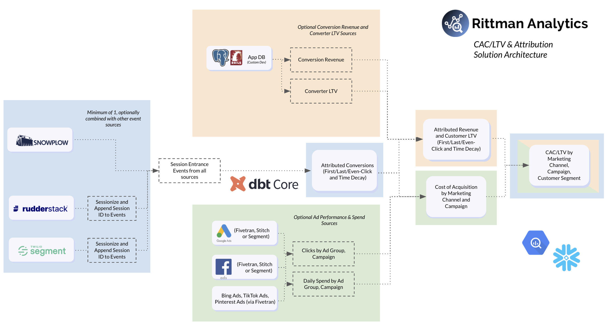
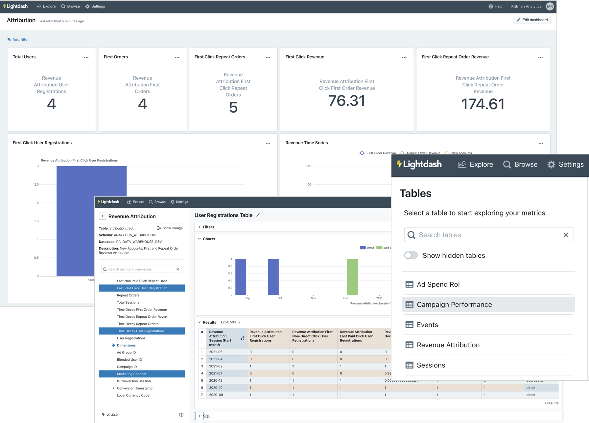
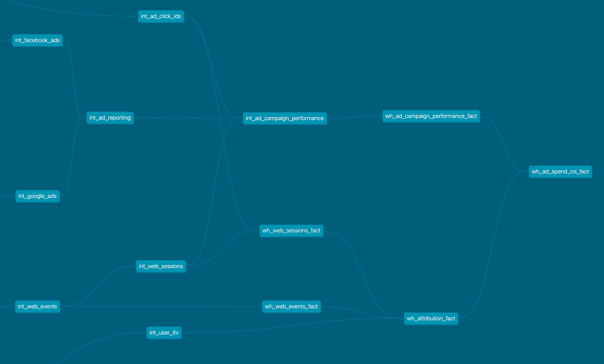
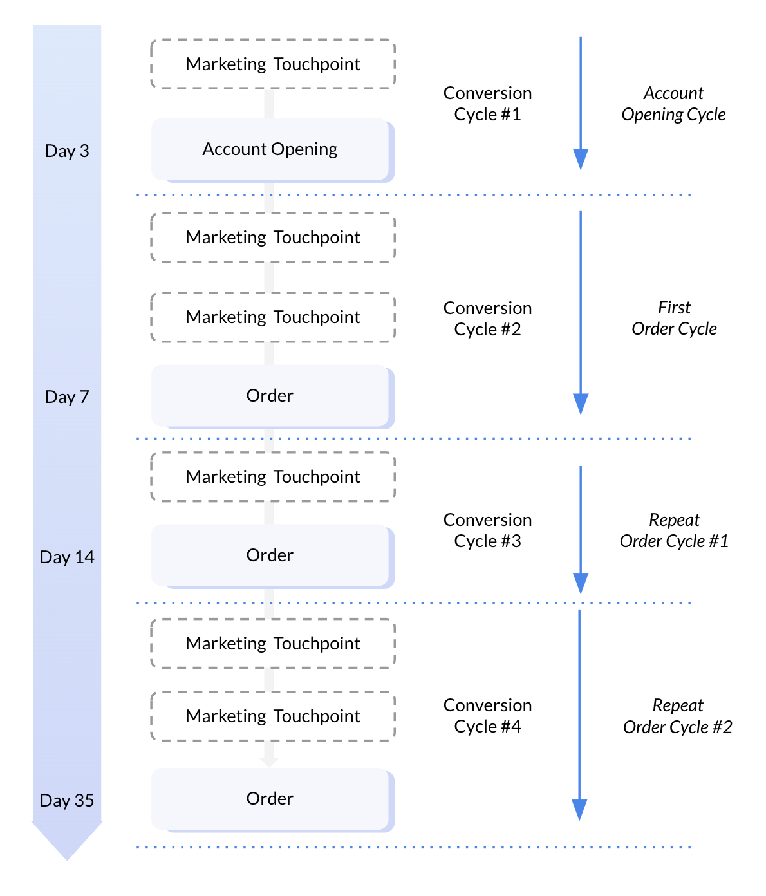

# RA Attribution for dbt

This dbt package provides a multi-touch, multi-cycle marketing attribution model that helps marketers better understand the contribution each online marketing channel makes to order revenue, and the cost and return on investment from ad channel spend that led to those conversions.

## Supported Data Sources and Warehouse Target

Snowplow, Segment and Rudderstack are supported as event sources for customer marketing touchpoints (page views and other user events, typically containing UTM parameter, referrer URLs and other marketing source identifiers) and conversion events (account opening, checkout events etc).

Orders and user registrations (account openings) can also be sourced, along with LTV and currency FX rates data, from your customer application database.

Google Ads, Facebook Ads and/or Snapchat Ads, via Fivetran, are currently supported as ad spend and performance data sources; credit and thanks are given to Fivetran for their community-released Google Ads, Facebook Ads and Snapchat Ads dbt modules for Ad Reporting, the code for which has in some cases been incorporated into this similarly open-sourced dbt package. Thanks Dylan and the rest of the Fivetran team!

Whilst as much use as possible has been made of dbt\_utils cross-database SQL functions, the target data warehouse platform is assumed to be Snowflake and this package has not yet been tested on BigQuery or other dbt-supported warehouse platforms.

## Lightdash Metrics Layer

This package also includes support for Lightdash, an open-source BI tool that provides Looker-like self-service ad-hoc querying and dashboarding and uses dbt to define and store its metrics layer in the form of extensions to the warehouse table definitions in the project's [schema.yml](models/warehouse/schema/schema.yml) file.

Lightdash metrics layer definitions included in this package include:

- Revenue Attribution (user registration, first and repeat orders / revenue, in local and global currencies, across all channels)
- Ad Spend RoI (Ad spend, clicks and impressions for ad channels along with revenue, orders and new users attributed to those channels)
- Ad Performance (Ad spend, clicks and impressions comparing data from ad networks with observed data from Snowplow, Segment and/or Rudderstack)
- Sessions (Segment, Snowplow, Rudderstack and/or offline transaction data sessionized, including sessions not leading to a conversion)
- Events (Segment, Snowplow, Rudderstack and/or offline transaction events including those not leading to a conversion)

### Dependencies

*   dbt core 1.0.1 or higher

    *   dbt\_utils 0.8.0 or higher

    *   fivetran\_utils 0.3.2 or higher

*   Snowflake data warehouse

*   Fivetran for Google Ads, Facebook Ads and Snapchat Ads API replication

*   One or more of either Snowplow, Segment or Rudderstack for marketing touchpoints and optionally, orders and account opening events 

*   Orders, Order Lines, User, Currency Rates and Customer LTV table extracts from your custom app database

*   (Optional) Lightdash

### How to Run this Package

1.  Clone or Fork this repo to create your own copy to work with

2.  Configure Fivetran to replicate your Facebook Ads, Google Ads and/or Snapchat Ads data into your Snowflake Data Warehouse

2.  Configure Fivetran to replicate your Orders, Order Details, Users, Currency Conversion Rates and Customer Lifetime Value tables also into Snowflake, and map the columns in your incoming tables to the expected columns in the STG\_CUSTOM\_EVENTS\_ORDER\_EVENTS, STG\_CUSTOM\_EVENTS\_REGISTRATION\_EVENTS, STG\_CUSTOM\_LTV\_CUSTOMER\_LTV and STG\_CURRENCY\_RATES dbt models

    1.  Sample data for these models is included as seed files in the package, and the default “true” setting for the `attribution_demo_mode` configuration variable will use these seed file values by default when you run the package

3.  Set the configuration variables in `dbt_project.yml` to point to your Snowflake database and schemas

4.  Run the package using `dbt build`.

5.  Optionally, provision a [self-hosted](https://github.com/lightdash/lightdash#quick-start) or [hosted-by Lightdash](https://lightdash.typeform.com/to/HFlicx4i?typeform-source=www.lightdash.com#source=website) Lightdash instance and configure it to use the git repo used to host your copy of this project as its metrics layer. 

### DAG Lineage Graphs

#### Overall Package Running in Demo Mode

#### Integration and Warehouse Layers

## Supported Attribution Models

|     |     |
| --- | --- |
| **Model Name** | **Description** |
| First Click | Attributes 100% of each first order, subsequent order and account opening to the first marketing or non-marketing touchpoint over a 30-day (default) look-back window |
| First Non-Direct Click | Attributes 100% of each first order, subsequent order and account opening to the first marketing touchpoint over a 30-day (default) look-back window, or the first direct touchpoint if no paid touchpoints are in the conversion cycle |
| First Paid Click | Attributes 100% of each first order, subsequent order and account opening to the first paid marketing touchpoint over a 30-day (default) look-back window, or the first direct touchpoint if no paid touchpoints are in the conversion cycle |
| Last Click | Attributes 100% of each first order, subsequent order and account opening to the last marketing or non-marketing touchpoint over a 30-day (default) look-back window |
| Last Non-Direct Click | Attributes 100% of each first order, subsequent order and account opening to the last marketing touchpoint over a 30-day (default) look-back window, or the last direct touchpoint if no paid touchpoints are in the conversion cycle |
| Last Paid Click | Attributes 100% of each first order, subsequent order and account opening to the last paid marketing touchpoint over a 30-day (default) look-back window, or the last direct touchpoint if no paid touchpoints are in the conversion cycle |
| Even Click | Attributes evenly a share of each first order, subsequent order and account opening to each touchpoint  over a 30-day (default) look-back window |
| Time-Decay | Attributes a percentage of the credit to all the channels on the conversion path for a time-decay period: the amount of credit for each channel is less (decaying) the further back in time the channel was interacted (0.5, 0.25, 0.125 etc) shared across all touchpoints for the day, over a 30-day (default) look-back window and 7-day (default) time-decay look-back window |
|     |     |

## Conversion Measures and Currencies

The attribution model within this package is a multi-cycle, multi-touch revenue attribution model that attributes

*   new account openings,

*   count and local/global currency value of first and repeat orders

*   customer LTV value (30, 60, 90, 180 and 365 days spend since first order) on first order conversion

## Account Opening, First and Repeat Order Conversion Cycles

Each conversion has its own conversion cycle with the assumption that account openings and first orders occur once at most for each customer, and repeat orders occur zero or more times.

## Package Configuration Variables

All configuration variables are contained with the `dbt_project.yml` dbt configuration file, along with configuration options for the Fivetran Google Ads, Facebook Ads and Snapchat Ads included modules.

|     |     |     |     |
| --- | --- | --- | --- |
| Category | Variable | Defaults | Purpose |
| Data Sources | stg\_custom\_events\_schema | CUSTOM\_DB\_EXTRACT | Custom event table schema |
| Data Sources | stg\_custom\_events\_database | RA\_DATA\_WAREHOUSE\_DEV | Custom event table database |
| Data Sources | stg\_custom\_ltv\_schema | CUSTOM\_DB\_EXTRACT | Custom ltv table schema |
| Data Sources | stg\_custom\_ltv\_database | RA\_DATA\_WAREHOUSE\_DEV | Custom ltv table database |
| Data Sources | stg\_custom\_currency\_schema | CUSTOM\_DB\_EXTRACT | Custom Currency FX table schema |
| Data Sources | stg\_custom\_currency\_database | RA\_DATA\_WAREHOUSE\_DEV | Custom Currency FX table database |
| Enabled Sources | attribution\_warehouse\_ad\_campaign\_sources | \['facebook\_ads','google\_ads'\] | sources, from facebook\_ads, google\_ads and snapchat\_ads that are in-scope for ad spend attribution |
| Enabled Sources | attribution\_warehouse\_ad\_group\_sources | \['facebook\_ads','google\_ads'\] | sources, from facebook\_ads, google\_ads and snapchat\_ads that are in-scope for ad spend attribution |
| Enabled Sources | attribution\_warehouse\_ad\_sources | \['facebook\_ads','google\_ads'\] | sources, from facebook\_ads, google\_ads and snapchat\_ads that are in-scope for ad spend attribution |
| Enabled Sources | attribution\_warehouse\_click\_id\_sources | \['google\_ads'\] | sources that provide click IDs for matching to Snowplow clicks |
| Enabled Sources | attribution\_warehouse\_currency\_rate\_sources | \['custom\_currency\_rates'\] | source of currency rates |
| Enabled Sources | attribution\_warehouse\_event\_sources | \['custom\_events\_order','custom\_events\_registration','snowplow\_events\_all'\] | event sources for revenue attribution |
| Enabled Sources | attribution\_warehouse\_ltv\_sources | \['custom\_ltv\_customer'\] | ltv sources for ltv measures |
| Model Parameters | attribution\_create\_account\_event\_type | user\_registration | event name for registration events |
| Model Parameters | attribution\_conversion\_event\_type | confirmed\_order | event name for order events |
| Model Parameters | attribution\_global\_currency | USD' | currency code for global amounts |
| Model Parameters | attribution\_lookback\_days\_window | 30  | how far back sessions can go to be eligable for attribution |
| Model Parameters | attribution\_time\_decay\_days\_window | 7   | over how many days do we decay the value of conversions for time-decay model |
| Model Parameters | attribution\_include\_conversion\_session | TRUE | whether the session containing the conversion event is within scope for attribution |
| Model Parameters | attribution\_match\_offline\_conversions\_to\_sessions | TRUE | whether orders and registrations are matched to Snowplow sessions or not |
| Model Parameters | attribution\_max\_session\_hours | 24  | maximum length of a session in hours to be considered for matching purposes |
| Model Parameters | attribution\_demo\_mode | TRUE | set to 'true' to source events |
| Measures | attribution\_models | _see dbt\_project.yml_ | list of model names to be appended to measures |
| Measures | attribution\_input\_measures | _see dbt\_project.yml_ | list of attribution input measures |
| Measures | attribution\_output\_conversion\_measures | _see dbt\_project.yml_ | list of attribution output conversion measures |
| Measures | attribution\_output\_revenue\_measures | _see dbt\_project.yml_ | list of attribution output revenue measures |

## Glossary

|     |     |     |
| --- | --- | --- |
| **Name** | **Example** | **Marketing Channel Data Source** |
| Conversion Session | Session in which one or more conversion events happened, for example a first or repeat order, or a new customer registration | UTM Source, Medium, Campaign etc for the landing page view (first page view in session)  Note that the attribution model can be configured to include or exclude conversion sessions from the scope of those over which conversions can be attributed.  This option is set via the `attribution_include_conversion_session` variable in the dbt\_project.yml configuration file, set to true by default i.e. conversion sessions are within scope for attribution of conversions.  Rationale for providing this option is that conversion sessions |
| Marketing Touchpoint Session | Session in which the landing website page or first mobile app interaction can be attributed to the Direct channel |     |
| Account Opening | Conversion event, one only over the lifetime of a user, containing the user’s registration event; may also contain marketing and non-marketing touchpoints, and a first order | UTM Source, Medium, Campaign etc for the landing page view (first page view in session), or none if the event did not happen within 30 minutes of a web or mobile app session |
| First Order Conversion, First Order Revenue | Conversion event, one only over the lifetime of a user, containing the first confirmed order for a user | UTM Source, Medium, Campaign etc for the landing page view (first page view in session), or none if the event did not happen within 30 minutes of a web or mobile app session |
| Repeat Order Conversion, Repeat Order Revenue | Conversion event, for which there may be none, one or more than one over the lifetime of a user, containing one or more confirmed orders for a user that are not the first confirmed order for that user | UTM Source, Medium, Campaign etc for the landing page view (first page view in session), or none if the event did not happen within 30 minutes of a web or mobile app session |

### Further Reading

- [Marketing Attribution Services from Rittman Analytics](https://rittmananalytics.com/marketing-attribution)
- [Multi-Channel Marketing Attribution using Segment, Google BigQuery, dbt and Looker](https://rittmananalytics.com/blog/2020/2/8/multichannel-attribution-bigquery-dbt-looker-segment)
- [Ad Spend and Campaign RoI Analytics using Segment, Looker, dbt and Google BigQuery](https://rittmananalytics.com/blog/2020/9/20/ad-spend-and-campaign-roi-analytics-using-segment-looker-dbt-and-googlenbspbigquery)
- [Lightdash, Looker and dbt as the BI Tool Metrics Layer](https://rittmananalytics.com/blog/2022/2/1/lightdash-looker-and-dbt-as-the-bi-tool-metrics-layer) and [Drill to Detail Podcast Episode with Katie Hindson](https://rittmananalytics.com/drilltodetail/2022/3/9/ircr55naz1h3dmzirywg8m28y239ca)

### Interested? Find out More

Rittman Analytics is a boutique analytics consultancy specializing in the modern data stack who can get you started with [Looker](https://rittmananalytics.com/data-analytics-main) (and Lightdash!), [centralise your data sources](https://rittmananalytics.com/data-centralization) and [enable your end-users and data team](https://rittmananalytics.com/data-team-enablement) with best practices and a [modern analytics workflow](https://rittmananalytics.com/getting-started-with-dbt).

If you’re looking for some help and assistance building-out your analytics capabilities on a modern, flexible and modular data stack, [contact us now](https://calendly.com/markrittman/30min/?/?) to organize a 100%-free, no-obligation call — we’d love to hear from you!
